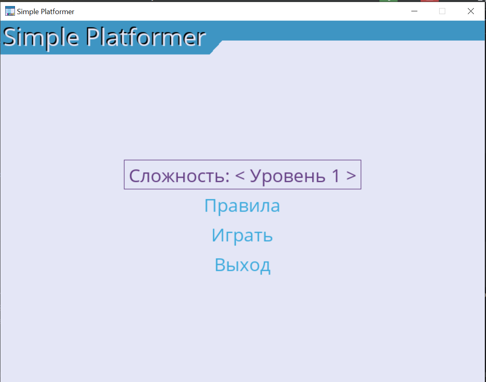
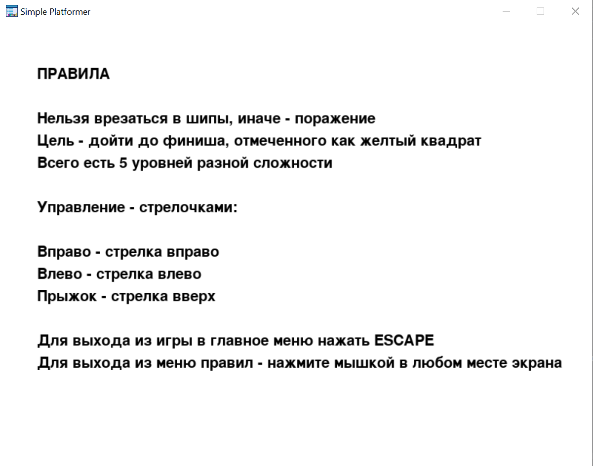

1. **Project Name**: Simple Platformer

---

2. **Team Lead**: Naumov Mikhail, Project Devs: Naumov Mikhail, Anchutin Innokenty, Teacher: Anatolyev Aleksey
   Vladimirovich

---

3. **Description** of the program: Персонаж в игре - куб, цель которого пройти все препятствия и дойти до финиша,
   пройдя
   тем самым на следующий уровень. Препятствия - шипы, игроку необходимо пройти паркур на
   платформах избегая эти препятствия (финал уровня - желтый куб). Особенность и преимущество заключается в ее
   оптимизации и минимализме, смотреть на минималистичные текстуры очень приятно глазу, при этом повышается плавность
   игры за счет отсутствия ненужных текстур. Так же нету ненужного функционала, только чистый и приятный плавный
   геймплей.
    1. Программа будет запускаться через терминал или среду разработки. На главном меню будут размещены
       основные кнопки: Играть, Правила, Выход и смена уровней.
    2. Полное закрытие самой игры не будет сопровождаться специфическими меню, при нажатии ESCAPE в игре вы выйдете в
       главное меню, а при нажатии Alt + F4 игра полностью закроется
    3. Игрок будет управлять персонажем при помощи стрелочек на клавиатуре. Стрелка вправо и влево - ходьба персонажа
       вправо и влево соответственно, стрелка вверх - прыжок.
    4. Других персонажей не будет, но будут объекты: платформа, шипы, финишная метка. Платформа - безопасное место
       по которому персонаж может без вреда передвигаться, шипы - опасные объекты, убивающие игрока, финишная
       метка - объект, переносящий игрока на следующий уровень.
    5. Действия прыжок, смерть и финиш будут сопровождаться звуками.

---

4. Project Description: Для всех объектов игры будут реализованы классы, вынесенные в отдельный файл, так же код для
   отрисовки окон будет вынесен в отдельный файл. Главный файл запускает функцию главного меню.

---

5. Program code plan:
    1. Переменные и константы: константы - 17 шт., переменные - 15+
    2. Функции: 6 шт. в файле functions.py, а так же методы классов
    3. Классы: 4 шт.
    4. Библиотеки: pygame, pygame_menu, sys, typing.

---

6. Graphical interface: 

---

7. Deadlines: нет четкого графика.